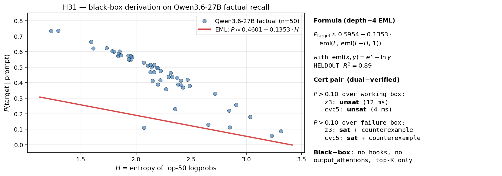
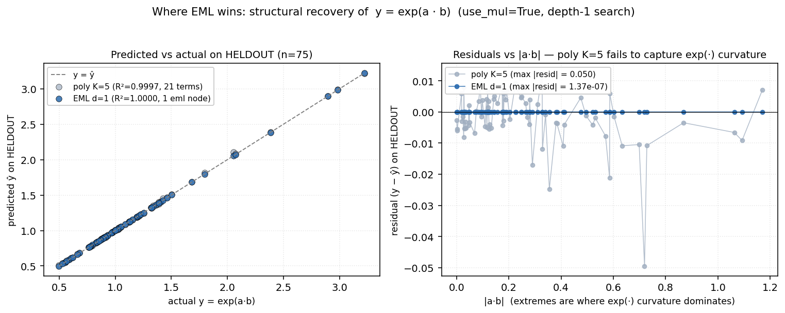

# emltorch

**Closed-form formulas for LLM behavior: discovered, reproducible, and SMT-verifiable.**

GPU-batched symbolic regression around a single primitive, the EML operator `eml(x, y) = exp(x) − ln(y)`, which Odrzywolek ([arXiv:2603.21852](https://arxiv.org/abs/2603.21852), 2026) proved is universal for elementary functions. One operator, one tree topology, and the search lands on formulas you can read, audit, and discharge through an SMT solver.



## Install

```bash
pip install "emltorch @ git+https://github.com/AI-Safeter/eml-torch.git"
# for .smt2 certificate emission and dual-solver verification (pulls z3 + cvc5, no transcendental build dep):
pip install "emltorch[smt] @ git+https://github.com/AI-Safeter/eml-torch.git"
```

Requires Python ≥ 3.10 and PyTorch ≥ 2.3. The core fit API runs on CPU or GPU; the SMT layer is pure-CPU and portable.

## Showcase 1: a black-box formula for Qwen3.6-27B factual recall

Give the model 50 prompts of the form *"The capital of {country} is"* and record only the top-K logprobs. No hooks, no hidden states, nothing inside the box. From `(L, H)`, induction lag and top-50 entropy, `emltorch` returns a depth-4 expression:

```
P_target ≈ 0.5954 − 0.1353 · eml(L, eml(L − H, 1))
```

HELDOUT R² = 0.89 on a 75/25 split. The fitted formula compiles to a portable `.smt2` certificate; z3 and cvc5 both dual-verify `P > 0.10` over the working box in single-digit milliseconds. Reproduction: `examples/h31_blackbox_cert/`.

## Showcase 2: same formula on 9 of 10 seeds (Gemma-4-31B-it)

Reproducibility is where symbolic regression usually breaks. On a 432-row induction probe of Gemma-4-31B-it, we ran `emltorch` and PySR ten times each with different seeds:

| Method | Nodes | HELDOUT R² | Seeds returning the same expression |
|---|---:|---:|---:|
| emltorch (single-stage) | 5 | 0.937 | 9 / 10 |
| emltorch (3-stage residual boost) | 15 | 0.958 | n/a |
| PySR | 10 | 0.953 | 1 / 10 |

Same formula on nine of ten seeds; PySR matches itself on one of ten. If you've spent an afternoon chasing PySR runs that almost-but-not-quite agree, this is the headline. The honest read: single-stage emltorch *trails* PySR on peak R² (0.937 vs 0.953), so the win here is reproducibility, not raw fit. The 3-stage 0.958 is one favourable split; the five-split boosted mean is 0.914 ± 0.03.

## Showcase 3: one formula across three model scales

Fourteen INDUCTION-PURE attention heads (identified by direct attention measurement) spread across Qwen3-4B, Qwen3-8B, and Qwen3-32B, 336 rows in total (8 induction prompts × 3 positions × 14 heads), fit by one pooled depth-4 EML expression at HELDOUT R² = 0.78. A polynomial K=5 baseline edges it on raw fit (R² = 0.82). The value here is parsimony rather than accuracy: a single readable closed form, with roughly an order of magnitude fewer effective parameters and an inspectable algebraic structure, predicts induction-head behavior across three model scales in the same family.

A bonus from the same family of heads: for the SEARCH-subtype, the closed-form attention decay is

```
log|w| = −7.78 + 0.42 · eml(eml(eml(1, j − T/2), j), eml(T/2, eml(T/2 − last_q + j, last_q − 2j)))
```

This is a biphasic peak in attention magnitude centered on the sequence midpoint, written out as elementary operators. EML R² = 0.762 vs polynomial K=5 R² = 0.560.

## Showcase 4: structural recovery of `eml((a·b), 1) ≡ exp(a·b)`



A depth-1 search with `use_mul=True` on 300 points of `exp(a·b)` returns exactly `eml((a*b), 1)`: one eml node, HELDOUT R² = 1.000000, max |residual| = 1.4e-7 (the float-precision floor). A polynomial OLS with K=5 and 21 cross-terms reaches R² = 0.9997 with max |residual| = 0.05, five orders of magnitude worse and structurally blind to the identity. When the underlying mechanism is exp, log, or multiplicative, EML recovers it; polynomials only approximate it.

## Library

```python
import emltorch as eml

# Single fit
result = eml.fit(x, y, depth=4)
print(result.expression)   # e.g. '+0.5954 + (-0.1353) * [eml(L, eml(L - H, 1))]'
print(result.r2)

# Multi-seed reproducibility: modal expression + stability stats
result = eml.fit_multi_seed(x, y, depth=4, n_seeds=10)

# Accuracy/complexity Pareto front
front = eml.fit_pareto(x, y, depths=(1, 2, 3, 4, 5))

# Iteratively fit residuals: stack EML stages when a single tree saturates
result = eml.fit_residual_boost(x, y, depth=3, n_stages=3)

# Emit a portable .smt2 certificate (z3 + cvc5 dual-verifiable)
smt2 = eml.eml_tree_to_smt2(
    formula=result.expression,
    var_ranges={"L": (-0.1, 0.1), "H": (0.0, 3.0)},
    target_op=">",
    target_value=0.10,
)
```

- `eml.fit`: evolutionary search over depth-d EML trees with leaf-constant polish.
- `eml.fit_multi_seed`: N-seed search; surfaces the modal expression and the identical-expression-rate (the reproducibility lever above).
- `eml.fit_pareto`: sweeps depths and returns the (nodes, R²) Pareto front with float-tolerance domination.
- `eml.fit_residual_boost`: multi-stage residual stacking; each per-stage tree is still SMT-translatable.
- `polish_optimizer="lbfgs"`: quasi-Newton constant refinement, sharper than Adam on smooth targets.
- `eml.eml_tree_to_smt2`: emit portable SMT-LIB2 with axiomatized `Exp` / `Ln`, no transcendental build dependency.

## When to use eml-torch

You want a formula you can read. A depth-4 EML tree is typically 5 to 15 nodes of elementary operators, compact enough for a slide.

You need reproducibility. Multi-seed search converges to the same expression on the majority of seeds, not a new tree each time you re-run.

Your target is exp, log, softmax, or multiplicative-gate-like. EML's primitive matches the mechanism, so structural recovery is exact rather than approximate.

You want a portable certificate. Fitted trees compile to SMT-LIB2 and discharge through z3 + cvc5 in milliseconds, with no transcendental build dependency.

You're doing interpretability on LLM internals or behavior. Every showcase above is a real frontier-scale model.

## License

MIT. EML operator: Odrzywolek, [arXiv:2603.21852](https://arxiv.org/abs/2603.21852).
