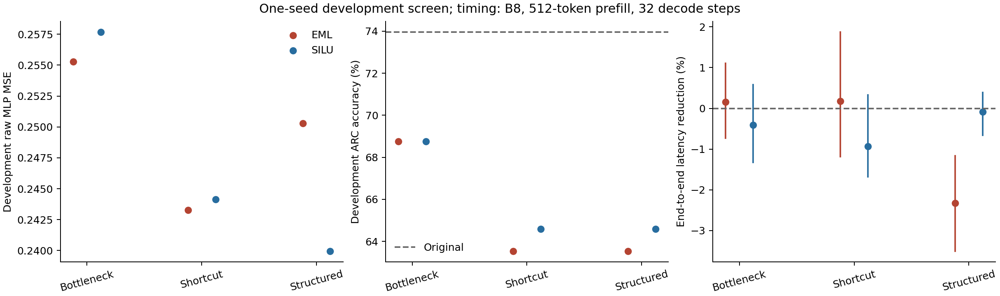

# Removing the decoder bottleneck: architecture screen

Removing the fixed output subspace improves reconstruction, but it does not
restore the model's quality at this budget. The affine shortcut lowers development
raw MLP error by 4.7% for EML and 5.2% for SiLU. This is an architectural
improvement in the observed screen, not an EML-specific advantage. Neither new
architecture passes the preregistered development gate.

The experiment therefore stops before longer training, depth exploration,
three-seed confirmation, or multiple-block replacement. Fresh confirmation data
remain unopened. This study does **not** establish that EML is inherently
inefficient, that optimization has converged, or that one cause explains most
of the previous quality failure.

## Scope, fairness, and the stop decision

The exact local model is `google/gemma-4-E2B-it`, revision
`3e22461f65e89153144f8adb70e3b8c2cc9845a7`. Configuration SHA-256 is
`1b28f3d2c3100f6c594754b81107428bd7b822a7f48272ca681dae9d2ec38330`.
Configuration, safetensors metadata, and native CUDA registration agree:
5,104,297,504 unique model parameters and 56,623,104 parameters in layer 26's MLP.
All six installed replacements forbid the original MLP forward and exclude its
parameters. Teacher activations are used only for offline supervision.

The [protocol](../PROTOCOL.md) was frozen before fitting. All six candidates use
seed **1103**, nonlinear depth **one**, approximately **6M coefficients**,
12,000 FP32 AdamW updates, identical per-seed minibatch streams, and the same
raw-plus-native-contribution objective. Each update samples 256 arithmetic and
256 language positions. The best development activation checkpoint is selected
at a common 200-update interval. Equal affine starting functions within each
architecture were verified on CUDA. Initializations differ across architectures
as declared in the protocol.

Each new architecture needed at least 10% improvement in both reconstruction
terms, at least 3 points of multiplication gain versus its matching bottleneck,
no more than 2 points of loss on the other development accuracy endpoints, and
at most 0.02 nats of language CE increase versus the original. None passes.
Raw/contribution gains are 4.70%/3.96% for shortcut EML, 5.24%/4.12% for shortcut
SiLU, 1.96%/1.76% for structured EML, and 6.87%/6.15% for structured SiLU.

The error threshold also prevents the conditional longer-training diagnostic
from activating. All selected checkpoints are at update 11,800. Curves continue
improving near the limit, so inadequate optimization remains possible.
**Seeds 2207 and 3301 were not run**, and no seed-variance estimate is supplied.
Depth two is implemented and its numerical deployment transformations were
tested, but it was not trained because the architecture gate did not pass.

## All completed seed results

Errors below use previously inspected selection activations with equal domain
weights. Raw MSE is divided by the training target's average centered variance;
contribution MSE is divided by the native contribution's average second moment.
These are different diagnostics, not interchangeable quality scores.

Development uses 64 operand groups per operation, each in code and reversed
formats; 32 larger-operand groups per operation are diagnostic. It also uses
96 ARC questions and 64 documents of BOS plus 256 tokens. Generation is capped
at 24 tokens and malformed responses remain wrong. Previously inspected data
are deliberately treated as development, including the former final split.

Original development scores: addition **95.31%**,
multiplication **45.31%**, division
**43.75%**, ARC **73.96%**,
and document CE **4.5721 nats**.

| Design | Activation | Raw MSE | Contribution MSE | Add % | Multiply % | Divide % | ARC % | CE nats | Fit seconds |
|---|---|---:|---:|---:|---:|---:|---:|---:|---:|
| bottleneck | eml | 0.255290 | 0.266346 | 94.53 | 35.94 | 44.53 | 68.75 | 4.4747 | 162.4 |
| bottleneck | silu | 0.257667 | 0.268949 | 93.75 | 37.50 | 42.19 | 68.75 | 4.4752 | 80.3 |
| shortcut | eml | 0.243286 | 0.255790 | 93.75 | 37.50 | 42.97 | 63.54 | 4.5089 | 302.2 |
| shortcut | silu | 0.244154 | 0.257878 | 94.53 | 39.06 | 43.75 | 64.58 | 4.5062 | 283.7 |
| structured | eml | 0.250279 | 0.261665 | 95.31 | 37.50 | 42.19 | 63.54 | 4.5031 | 131.9 |
| structured | silu | 0.239963 | 0.252402 | 93.75 | 37.50 | 42.97 | 64.58 | 4.5018 | 88.1 |

All full-width variants lose 4.17–5.21 ARC points relative to their matching
bottleneck control. Language CE improves relative to the original for every
student, while ARC and multiplication deteriorate. This is direct evidence
that lower activation error or document CE alone is insufficient for this
replacement's quality decision.

Paired 95% bootstrap intervals, grouped by operand pair across prompt formats,
are in `summary.json` and the raw predictions are in `development/`. For shortcut
EML, the multiplication loss versus the original is 7.81 points [2.34, 13.28]
and ARC loss is 10.42 points [5.21, 16.67]. Shortcut SiLU loses 6.25 multiplication
points [0.78, 12.50] and 9.38 ARC points [4.17, 15.62]. These are **descriptive
intervals on inspected development data**, conditional on the fitted seed;
they do not replace confirmation or account for candidate selection.

The direct EML-versus-SiLU multiplication intervals include zero in every
architecture. No consistent downstream EML advantage is established.
Code-format multiplication also drops: original 46/64, shortcut EML 38/64,
shortcut SiLU 40/64. All three parse 63/64 responses, so this diagnostic loss
cannot be explained by an increased count of malformed outputs alone.
All format, parsing, and shifted-operand results remain in the JSON evidence.
No arithmetic mechanism is inferred from these measurements.

## What the architectural change removes

The [derivation](../THEORY.md) distinguishes output-subspace restrictions from
input information loss. The bottleneck output lies in a learned affine subspace
of dimension at most 512; its input encoder also discards directions. The
shortcut removes the complete prediction's fixed output-subspace restriction,
but nonlinear dependence remains confined to a compact encoder and decoder.
Outside its correction decoder, prediction must remain affine. Structured
residual stages keep 1,536-dimensional states and diagonal-plus-low-rank maps;
they remove the mandatory 512-state and rank-512 output constraints. They still
have finite depth, structured mixing, normalization, and a limited budget.

The correctly recomputed empirical normalized raw-MSE floors are **0.141368**
for the bottleneck and **0.104122** for the shortcut. The latter uses the
*unregularized optimal affine residual*, not a ridge residual. The FP64 normal
equation condition number is 8,311.4; relative normal-equation residual is
1.50e-15 and direct residual-covariance disagreement is 2.06e-14. The structured
design has no positive floor implied solely by a fixed output subspace; its
general bound here is zero, which is not evidence that its finite network can
achieve zero error. These are training-distribution bounds, not bounds on
contribution error, unseen data, answer quality, or EML in general.

| Design | Activation | Train raw MSE | Outside decoder MSE | Within decoder MSE | Output covariance rank |
|---|---|---:|---:|---:|---:|
| bottleneck | eml | 0.225248 | 0.148124 | 0.077124 | 512 |
| bottleneck | silu | 0.226827 | 0.148408 | 0.078419 | 512 |
| shortcut | eml | 0.212267 | 0.123445 | 0.088821 | 1536 |
| shortcut | silu | 0.216391 | 0.126793 | 0.089598 | 1536 |
| structured | eml | 0.221693 | — | — | 1483 |
| structured | silu | 0.210786 | — | — | 1487 |

For EML, shortcut outside-decoder error falls from 0.148124 to 0.123445, while
inside-decoder error rises from 0.077124 to 0.088821. Its best-affine floor outside
the **learned** decoder is 0.113672, leaving a 0.009773 gap attributable to the
learned affine component relative to that empirical optimum. The complete
shortcut floor also allows the decoder to move and is therefore lower.
Inside/outside quantities use each model's own decoder, not identical axes.

The shortcut's full affine map uses 2,360,832 coefficients. At the fixed budget,
the compact EML nonlinear width drops from 2,873 to 1,339 units, and SiLU width
from 4,311 to 2,009. Structured EML uses rank 393 per map and structured SiLU rank
590: EML pays for two independent argument maps, while both retain the same
1,536-dimensional state. Matching budget therefore does not mean matching
inner width or factor rank.

This supports a concrete capacity-allocation explanation: part of the recovered
output-space capacity is offset by a harder or less capable nonlinear fit at
the same coefficient budget. It does not uniquely separate encoder loss,
nonlinear capacity, initialization, optimization, and the competing contribution
objective. Structured SiLU fits better than structured EML in this seed, whereas
EML fits slightly better within the bottleneck and shortcut families. The
activation ranking depends on architecture.

Covariance rank is measured at a relative eigenvalue cutoff of 1e-6. Shortcut
predictions reach rank 1,536 and structured predictions approximately 1,485,
yet general-knowledge quality worsens. Full covariance rank does not guarantee
injectivity or preserved information; even powers of one input coordinate can
have full covariance rank while discarding other coordinates. Random
Jacobian-direction sensitivities and structured projection spectra are included
as diagnostics, not semantic information certificates.

There is no evidence of widespread exponential clamping in the sampled training
telemetry: bottleneck and shortcut EML have zero clamps; structured EML has
7 clamps in 47,185,920 sampled arguments and clips gradient norm in 40/12,000
updates. This limited telemetry does not rule out optimization difficulties.
Training versus selection error gaps persist for every design; the experiment
does not assign them uniquely to distribution shift or capacity.

A separate CUDA precision audit evaluates all 32,768 selection positions in
unfolded FP32, folded FP32, folded BF16, and unfolded BF16. Folding alone changes
normalized predictions by at most 4.02e-12 MSE. BF16 deployment changes raw target
MSE by at most 0.000226 in absolute value, below 0.1% of each corresponding
FP32 raw MSE. It therefore does not explain the bulk reconstruction gap.
Small numerical changes can still alter individual downstream answers; this
check is not an end-to-end precision-invariance guarantee. See
`precision-audit.json` for every architecture and activation.

## Complete accounting and measured inference cost

| Design | Activation | Trainable parameters | Training buffers | Deployed parameters | Deployed buffers |
|---|---|---:|---:|---:|---:|
| bottleneck | eml | 5,995,122 | 4,609 | 5,994,610 | 0 |
| bottleneck | silu | 5,995,223 | 4,609 | 5,994,711 | 0 |
| shortcut | eml | 5,995,126 | 4,609 | 5,994,614 | 0 |
| shortcut | silu | 5,994,969 | 4,609 | 5,994,457 | 0 |
| structured | eml | 5,995,008 | 4,609 | 5,993,472 | 3,072 |
| structured | silu | 5,995,008 | 4,609 | 5,993,472 | 3,072 |

The native pre/post-feedforward normalizations retain 3,072 parameters in the
complete model. Structured deployment retains 3,072 input-normalization values;
the other designs fold them into projections. Every shortcut, bias, projection,
normalization, decoder, and retained buffer is included. The release audit lists
every deployed tensor. The whole model retains the checkpoint's embeddings and
multimodal components even though the evaluated workload is text-only.

Each replacement removes approximately **0.992% of total model parameters** and
compresses the individual block by about **9.44×**. Thus this single-block result
cannot satisfy the 20% total-model target. No multiple-block expansion was run.

Timing uses the actual installed path with the whole model on GPU: native eager
SDPA for both paths, the same algebraic folding policy, ten warm-ups, thirty
alternating paired repeats, and synchronized CUDA/wall clocks. The main workload
is **batch 8, 512 prefill tokens, 32 fixed cached decoding steps**. The uncertainty
resamples six contiguous blocks of five pairs with 10,000 bootstrap replicates.
Positive reduction means faster replacement. All four batch/prefill workloads
are recorded separately in `timing.csv` and `benchmark/`.

| Design | Activation | Original E2E ms | Replacement E2E ms | Reduction % [95% block CI] |
|---|---|---:|---:|---:|
| bottleneck | eml | 1327.28 | 1325.19 | 0.16 [-0.73, 1.10] |
| bottleneck | silu | 1465.77 | 1471.80 | -0.41 [-1.33, 0.58] |
| shortcut | eml | 1299.00 | 1296.66 | 0.18 [-1.18, 1.87] |
| shortcut | silu | 1476.13 | 1489.88 | -0.93 [-1.68, 0.33] |
| structured | eml | 1462.12 | 1496.06 | -2.32 [-3.50, -1.16] |
| structured | silu | 1489.80 | 1491.07 | -0.09 [-0.66, 0.39] |

No primary-workload point estimate or its 95% interval reaches the 10% latency
reduction target. Shortcut EML's measured reduction is 0.18% [-1.18, 1.87];
structured EML is 2.32% slower [1.16, 3.50] than its paired original. Absolute
means must not be compared across separate candidate runs: the original model
itself ranges from 1.299 to 1.490 seconds as shared-GPU conditions change.
The within-run paired comparison is the supported cost comparison.

| Design / activation | Prefill ms, original → replacement | Decode ms, original → replacement | Output tokens/s, original → replacement | Peak allocated GiB, original → replacement |
|---|---:|---:|---:|---:|
| bottleneck-eml | 72.61 → 72.30 | 1254.67 → 1252.89 | 193.07 → 193.38 | 10.1058 → 10.0118 |
| bottleneck-silu | 152.60 → 149.97 | 1313.17 → 1321.83 | 174.76 → 174.06 | 10.1058 → 10.0115 |
| shortcut-eml | 73.00 → 72.05 | 1226.00 → 1224.61 | 197.17 → 197.48 | 10.1058 → 10.0118 |
| shortcut-silu | 150.89 → 150.35 | 1325.24 → 1339.53 | 173.53 → 171.91 | 10.1058 → 10.0118 |
| structured-eml | 149.99 → 154.72 | 1312.12 → 1341.34 | 175.25 → 171.32 | 10.1058 → 10.0121 |
| structured-silu | 151.80 → 150.80 | 1337.99 → 1340.27 | 171.98 → 171.83 | 10.1058 → 10.0120 |

Prefill, decoding, output/total/prefill throughput, CUDA event time, peak allocated
and reserved memory, and unique cache storage are separate fields in the raw
records and summary. Isolated peak memory comes from each path's first warm-up
with unused allocator cache cleared. Timed switches retain the warmed allocator;
reserved memory in those samples can include previous comparison allocations.
The original 113,246,208-byte MLP is staged on CPU for paired comparisons, outside
the installed GPU model and outside timing. Comparison transfers, loading,
tokenization, service queuing, and warm-up are excluded. Fixed-token decoding
measures a declared workload, not a production request-latency guarantee.

Other experiments continued on the H100s. GPU UUIDs and before/after utilization
and free-memory telemetry accompany every timing record. These intervals
quantify within-run variation under shared-device conditions, not independent
serving deployments. Training times also depend on GPU sharing; equal update
counts do not imply equal elapsed time. Quality evaluation uses the previous
bitwise-validated CPU PLE lookup in every method; latency benchmarks keep that
table on GPU and include its storage.

## Budget, reproducibility, and defensible claim

The declared cap was eight H100 device-hours. This completed run charged
**1.4164 device-hours**, counting elapsed time of our GPU subprocesses,
including startup, training, checks, exports, shared-device delays, and timing.
The ledger preserves every job. No other experiment was stopped. Unused budget
does not override the prospective screen's stopping rules. The initial release
audit stopped on a one-unit-in-the-last-place difference between GPU mean and
CPU division (0.6145833333333333 versus 0.6145833333333334). Audit v2 uses an
absolute 1e-12 tolerance for floating comparisons and keeps integer/boolean
comparisons exact. The failed attempt remains charged and its log is retained;
no fitting, evaluation, timing, or numerical-statistics implementation changed.

Run [the reproduction commands](../README.md). `reproduce.py --release` resumes
completed jobs, enforces memory admission and the budget, applies the observed
screen-stop decision, exports all students, and audits results. CUDA checks cover
dense/structured forward and derivative agreement, FP32 folding and BF16
roundoff, original-block removal in prefill and cached decoding, exact exported
reload, equal minibatch streams, raw-error decomposition, and agreement of the
vectorized paired statistics with the previous reference implementation. A
standalone exported shortcut also generated successfully without activation data.
Large checkpoints and activation tensors remain outside Git; hashes and
per-tensor accounting are included with runnable regeneration commands.

Fresh confirmation was frozen before fitting: 1,024 ordinary groups per
operation, 128 shifted groups per operation, 1,024 previously unused ARC
questions, and 256 documents from previously unused hostnames. Historical
operand pairs/donors, document hashes/hostnames, and question IDs/text hashes
were excluded. Freshness is relative to this study, not model pretraining.
The audit verifies that no confirmation outputs or selection-for-confirmation
file exist. Frozen confirmation criteria remain available for a future
qualifying architecture; they were not relaxed after this screen.

**Strongest defensible claim:** the old affine-decoder constraint is a real,
measurable contributor to reconstruction error. Removing it yields modest
improvements shared by EML and SiLU, while consuming capacity elsewhere and
failing to restore downstream quality in this fixed-budget screen. This rules
out treating high output covariance rank as a sufficient remedy. It does not
establish a general EML limitation or identify optimization versus finite
capacity as the sole remaining cause. No deployment success or recovered
arithmetic algorithm is claimed.
