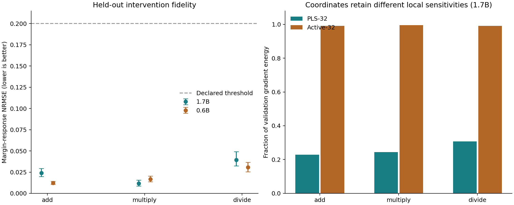
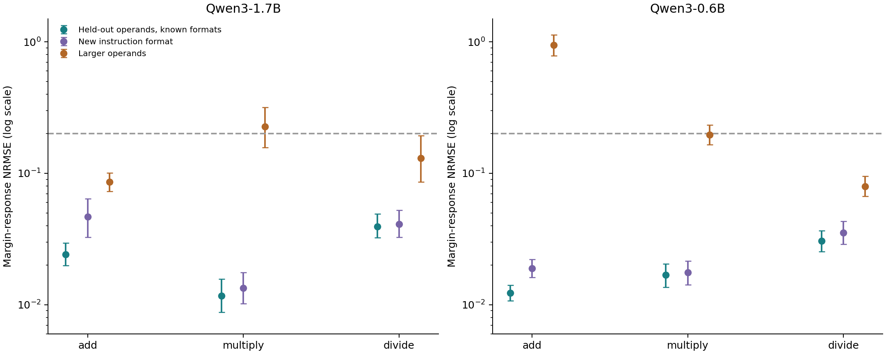

# Equations that survive arithmetic interventions

We replaced one localized scalar contribution inside two frozen Qwen models with small EML networks. All six operation–model combinations meet the declared primary fidelity criteria, including their grouped confidence-interval checks. This is a useful component-distillation result. It does not establish that an EML unit represents addition or that the complete language model can be replaced by an equation.

The useful change was to choose upstream coordinates from the target's input gradients. A coordinate system optimized to predict observed values can discard directions needed to reproduce interventions. Gradient-based coordinates retain those directions. Both EML and ordinary neural heads benefit.

Open [the interactive explorer](explorer.html) to change operands, prompt formats, and interpolation strength. Its coefficient equation runs locally in JavaScript; the downstream model responses are frozen GPU measurements. Read [the protocol](PROTOCOL.md) and [reproduction instructions](REPRODUCE.md) for exact scope.

## Primary held-out results

The table consistently reports the active rank-32 family: gradient-loss weight 0.1 for 1.7B and 0 for the prespecified smaller-model replication. It does not pick the best test result across feature variants. Each family selects its head and seed by validation alone. NRMSE is error RMS divided by the original model's margin-response RMS; lower is better. Brackets are 95% intervals from 5,000 paired operand-group bootstrap resamples. Accuracy is strict complete-answer accuracy.

| Model | Operation | Original accuracy | EML accuracy | Response NRMSE [95% CI] | Correlation |
| --- | --- | --- | --- | --- | --- |
| 1.7B | add | 97.14% | 97.14% | 0.0241 [0.0199, 0.0295] | 0.99970 |
| 1.7B | multiply | 90.10% | 89.97% | 0.0117 [0.0088, 0.0156] | 0.99993 |
| 1.7B | divide | 85.59% | 85.94% | 0.0394 [0.0325, 0.0492] | 0.99921 |
| 0.6B | add | 48.70% | 48.96% | 0.0123 [0.0107, 0.0141] | 0.99990 |
| 0.6B | multiply | 41.54% | 41.54% | 0.0168 [0.0136, 0.0204] | 0.99984 |
| 0.6B | divide | 68.92% | 68.92% | 0.0306 [0.0254, 0.0366] | 0.99944 |

These tests use 256 independent operand pairs for addition and multiplication and 192 for division, each in three formats. The four evaluated interior interpolation strengths were absent from fitting. Accuracy-change bootstrap intervals can collapse to [0, 0] when every observed group difference is zero. A declared interval-check pass is descriptive and does not certify the absence of rare regressions or formal one-point noninferiority. A low error means that the replacement follows the original model's behavior; it does not mean the original answer was correct. The 0.6B model is particularly weak on these prompts.

## Why the feature representation matters

| Model | Operation | Validation gradient energy in PLS-32 | In active-32 |
| --- | --- | --- | --- |
| 1.7B | add | 22.82% | 99.15% |
| 1.7B | multiply | 24.37% | 99.55% |
| 1.7B | divide | 30.74% | 99.05% |
| 0.6B | add | 19.02% | 99.62% |
| 0.6B | multiply | 22.71% | 99.77% |
| 0.6B | divide | 23.30% | 98.62% |

For any differentiable predictor of linear coordinates, its input gradient lies in their span. Omitted target-gradient energy therefore bounds the best possible local derivative fit for that representation. It does not bound natural arithmetic accuracy. On 1.7B addition, a perturbation nearly invisible to the PLS features (maximum standardized coordinate change 3.58e-7) changes the true scalar by 0.542 RMS. This is a representation limitation that adding head depth cannot repair.

## Neural, linear, and original-neuron controls

| Model | Operation | Replacement | Primary NRMSE [95% CI] | Coordinate-edit NRMSE |
| --- | --- | --- | --- | --- |
| 1.7B | add | mean | 1.0000 [1.0000, 1.0000] | 1.0000 |
| 1.7B | add | linear | 0.3559 [0.2928, 0.4318] | 0.5431 |
| 1.7B | add | sparse16 | 0.2834 [0.2353, 0.3409] | 0.4900 |
| 1.7B | add | sparse_selected | 0.0731 [0.0603, 0.0879] | 0.2547 |
| 1.7B | add | heads/eml | 0.1328 [0.1069, 0.1637] | 0.6583 |
| 1.7B | add | heads/neural | 0.1210 [0.0988, 0.1468] | 0.6814 |
| 1.7B | add | heads-active-r32-g0/eml | 0.0278 [0.0227, 0.0337] | 0.0375 |
| 1.7B | add | heads-active-r32-g0/neural | 0.0417 [0.0345, 0.0495] | 0.0565 |
| 1.7B | add | heads-active-r32-g0.1/eml | 0.0241 [0.0199, 0.0295] | 0.0465 |
| 1.7B | add | heads-active-r32-g0.1/neural | 0.0292 [0.0244, 0.0347] | 0.0546 |
| 1.7B | multiply | mean | 1.0000 [1.0000, 1.0000] | 1.0000 |
| 1.7B | multiply | linear | 0.2459 [0.1865, 0.3197] | 1.1405 |
| 1.7B | multiply | sparse16 | 0.0526 [0.0421, 0.0664] | 0.1253 |
| 1.7B | multiply | sparse_selected | 0.0155 [0.0126, 0.0196] | 0.0763 |
| 1.7B | multiply | heads/eml | 0.1154 [0.0961, 0.1408] | 0.8291 |
| 1.7B | multiply | heads/neural | 0.1170 [0.0929, 0.1474] | 0.8492 |
| 1.7B | multiply | heads-active-r32-g0/eml | 0.0156 [0.0115, 0.0213] | 0.0973 |
| 1.7B | multiply | heads-active-r32-g0/neural | 0.0180 [0.0147, 0.0228] | 0.0870 |
| 1.7B | multiply | heads-active-r32-g0.1/eml | 0.0117 [0.0088, 0.0156] | 0.0431 |
| 1.7B | multiply | heads-active-r32-g0.1/neural | 0.0129 [0.0091, 0.0182] | 0.0487 |
| 1.7B | divide | mean | 1.0000 [1.0000, 1.0000] | 1.0000 |
| 1.7B | divide | linear | 0.4962 [0.3926, 0.6505] | 1.2434 |
| 1.7B | divide | sparse16 | 0.1012 [0.0723, 0.1372] | 0.3151 |
| 1.7B | divide | sparse_selected | 0.0187 [0.0146, 0.0247] | 0.0274 |
| 1.7B | divide | heads/eml | 0.2085 [0.1691, 0.2652] | 0.6402 |
| 1.7B | divide | heads/neural | 0.1809 [0.1419, 0.2369] | 0.6458 |
| 1.7B | divide | heads-active-r32-g0/eml | 0.0574 [0.0429, 0.0780] | 0.2163 |
| 1.7B | divide | heads-active-r32-g0/neural | 0.0604 [0.0470, 0.0786] | 0.1814 |
| 1.7B | divide | heads-active-r32-g0.1/eml | 0.0394 [0.0325, 0.0492] | 0.1788 |
| 1.7B | divide | heads-active-r32-g0.1/neural | 0.0406 [0.0333, 0.0512] | 0.1748 |
| 0.6B | add | mean | 1.0000 [1.0000, 1.0000] | 1.0000 |
| 0.6B | add | linear | 0.0949 [0.0836, 0.1072] | 0.6144 |
| 0.6B | add | sparse16 | 0.0868 [0.0772, 0.0968] | 0.3821 |
| 0.6B | add | sparse_selected | 0.0350 [0.0309, 0.0394] | 0.1176 |
| 0.6B | add | heads-active-r32-g0/eml | 0.0123 [0.0107, 0.0141] | 0.0447 |
| 0.6B | add | heads-active-r32-g0/neural | 0.0132 [0.0115, 0.0151] | 0.0545 |
| 0.6B | multiply | mean | 1.0000 [1.0000, 1.0000] | 1.0000 |
| 0.6B | multiply | linear | 0.2531 [0.2186, 0.2973] | 1.0863 |
| 0.6B | multiply | sparse16 | 0.0609 [0.0495, 0.0739] | 0.1754 |
| 0.6B | multiply | sparse_selected | 0.0137 [0.0118, 0.0161] | 0.0999 |
| 0.6B | multiply | heads-active-r32-g0/eml | 0.0168 [0.0136, 0.0204] | 0.1124 |
| 0.6B | multiply | heads-active-r32-g0/neural | 0.0185 [0.0157, 0.0219] | 0.1166 |
| 0.6B | divide | mean | 1.0000 [1.0000, 1.0000] | 1.0000 |
| 0.6B | divide | linear | 0.3227 [0.2833, 0.3749] | 0.7141 |
| 0.6B | divide | sparse16 | 0.0741 [0.0612, 0.0901] | 0.1866 |
| 0.6B | divide | sparse_selected | 0.0195 [0.0158, 0.0245] | 0.0430 |
| 0.6B | divide | heads-active-r32-g0/eml | 0.0306 [0.0254, 0.0366] | 0.0867 |
| 0.6B | divide | heads-active-r32-g0/neural | 0.0294 [0.0250, 0.0346] | 0.0980 |

Replacing the scalar with its training mean lowers 1.7B accuracy by 2.60 points on addition, 7.68 on multiplication, and 9.37 on division. This control shows that the selected contribution affects behavior. EML is competitive with the same-feature neural controls, and individual comparisons favor different families. Sparse original SwiGLU neurons can be excellent approximators, especially at the larger 64-neuron budget. Sixteen such neurons have approximately the same input-weight storage as a rank-32 encoder. The linear control is fit on training data and selected by validation; on 0.6B it was added after the initial evaluation and is a disclosed supplementary control.

The coordinate diagnostic edits active coordinates 0, 1, 7, and 31 by ±0.25 training standard deviations. These are deliberately local and potentially off the natural activation manifold. They establish fidelity on the tested edits, not unrestricted causal equivalence.

## Smaller equations on an additional operand cohort

| Model | Operation | Input rank | EML units | Head coefficients | Encoder coefficients | Fresh NRMSE [95% CI] | Validation size criterion met |
| --- | --- | --- | --- | --- | --- | --- | --- |
| 1.7B | add | 16 | 8 | 297 | 32768 | 0.0901 [0.0517, 0.1348] | yes |
| 0.6B | add | 4 | 4 | 49 | 4096 | 0.0623 [0.0508, 0.0763] | yes |
| 0.6B | multiply | 16 | 8 | 297 | 16384 | 0.0364 [0.0275, 0.0492] | yes |
| 0.6B | divide | 16 | 8 | 297 | 16384 | 0.0469 [0.0327, 0.0689] | no |

Each row uses 96 additional operand pairs, disjoint from all original splits, with three formats and four unseen interior interpolation strengths. The grid and pairs were frozen before compact fitting. Selection takes the smallest encoder-plus-head meeting validation value and response MSE ≤0.005, otherwise the best validation head with an explicit failure label. The 0.6B division head misses that validation target. The 1.7B addition follow-up uses the same new pairs as 0.6B; it is a model replication.

On the extra cohort, the 1.7B eight-unit head changes accuracy from 97.22% to 97.57%. The 0.6B four-unit head changes 46.88% to 47.22%, but its accuracy-change interval extends to −1.04 percentage points, narrowly missing the conservative −1.00-point criterion. The four-unit result contains 49 head coefficients, plus 4,096 encoder coefficients. It is not a 49-number replacement for the whole model. Encoder and head counts above exclude normalization statistics, the output direction, and the model that supplies upstream activations. Frozen `stored_coefficients` fields likewise mean encoder plus head; the run's normalization metadata remain in each component checkpoint.

## New initialization replication

| Seed | EML NRMSE [95% CI] | SiLU NRMSE [95% CI] | EML accuracy change (pp) |
| --- | --- | --- | --- |
| 59 | 0.0248 [0.0176, 0.0337] | 0.0253 [0.0171, 0.0361] | +0.000 |
| 71 | 0.0257 [0.0198, 0.0336] | 0.0251 [0.0188, 0.0333] | +0.000 |
| 83 | 0.0261 [0.0195, 0.0351] | 0.0328 [0.0221, 0.0492] | +0.000 |
| 97 | 0.0297 [0.0204, 0.0420] | 0.0241 [0.0171, 0.0335] | +0.000 |

All four additional seeds are reported, with no selection among seeds. They use the fixed 1.7B addition encoder, rank 32, width 32, and gradient weight 0.1. Validation selects a checkpoint within each seed. Evaluation uses the same 96-pair compact cohort. This checks initialization sensitivity conditional on a fitted encoder; it is not four independent repetitions of localization and data sampling.

## Where the replacements fail

| Model | Operation | Held-out condition | EML NRMSE [95% CI] | Original accuracy | EML accuracy |
| --- | --- | --- | --- | --- | --- |
| 1.7B | add | test-new-format | 0.0469 [0.0325, 0.0639] | 97.27% | 97.27% |
| 1.7B | add | shift | 0.0859 [0.0729, 0.1009] | 97.40% | 97.27% |
| 1.7B | add | carry | 0.0231 [0.0188, 0.0284] | 99.09% | 99.22% |
| 1.7B | multiply | test-new-format | 0.0134 [0.0102, 0.0176] | 91.02% | 90.62% |
| 1.7B | multiply | shift | 0.2264 [0.1565, 0.3165] | 17.58% | 17.58% |
| 1.7B | divide | test-new-format | 0.0410 [0.0327, 0.0524] | 83.85% | 83.85% |
| 1.7B | divide | shift | 0.1299 [0.0858, 0.1931] | 48.61% | 47.92% |
| 0.6B | add | test-new-format | 0.0189 [0.0162, 0.0221] | 67.58% | 67.58% |
| 0.6B | add | shift | 0.9424 [0.7841, 1.1335] | 64.97% | 63.02% |
| 0.6B | add | carry | 0.0146 [0.0123, 0.0173] | 42.06% | 42.06% |
| 0.6B | multiply | test-new-format | 0.0176 [0.0142, 0.0215] | 45.31% | 45.31% |
| 0.6B | multiply | shift | 0.1959 [0.1656, 0.2327] | 3.26% | 3.26% |
| 0.6B | divide | test-new-format | 0.0353 [0.0289, 0.0433] | 60.94% | 60.94% |
| 0.6B | divide | shift | 0.0795 [0.0668, 0.0947] | 23.78% | 23.78% |

The smaller model's addition replacement fails under the operand-range shift: response NRMSE rises to about 0.94. The larger model's multiplication replacement also misses the 0.20 response-error threshold, at 0.226; the smaller multiplication model is below it by point estimate but not by its interval upper bound. In-range and prompt-format success do not justify unrestricted extrapolation. The smaller model's shifted multiplication accuracy is itself only a few percent. The contrast-conditioned sample, one scalar direction, one prefill position, small number of models, and extensive validation search all limit generalization.

## Diagnosing the smaller-model range failure

An exploratory diagnostic, fixed after observing the failure and without refitting, compares the first 64 addition pairs per split in all three formats at strengths 0, 0.5, and 1. In 0.6B, the active basis captures 99.58% of target-gradient energy in range but 84.10% under the operand shift. About 62.3% of shifted mixed inputs leave at least one training coordinate range, versus 1.0% in range. No EML numerical guard activates. The 1.7B addition comparison retains 97.33% of shifted gradient energy. A separate 1.7B multiplication diagnostic retains 91.24%, with only 5.4% of shifted inputs outside the coordinate box; a simple range check is therefore not a fidelity certificate. These observations are consistent with a combination of changed local sensitivities and extrapolation; they do not isolate each contribution. Adding depth to a fixed low-rank head cannot recover omitted local input directions. Raw diagnostic metrics distinguish scalar-coefficient error from the primary downstream-margin metric.

## A deployable real-data surrogate

| Split | Teacher RMSE (dB) | EML RMSE (dB) | MSE ratio | Ratio 95% CI |
| --- | --- | --- | --- | --- |
| train | 1.334 | 1.478 | 1.228 | [1.136, 1.319] |
| validation | 2.578 | 2.727 | 1.119 | [1.029, 1.186] |
| test | 3.193 | 3.140 | 0.967 | [0.851, 1.142] |
| shift | 5.072 | 5.063 | 0.996 | [0.769, 1.362] |

A 422-coefficient EML head distills a frozen 1,281-parameter airfoil-noise teacher. The test RMSE is 3.140 dB versus 3.193 dB. The test MSE-ratio interval includes 1 and exceeds the declared 1.05 upper target, so there is no statistical superiority or established 5% noninferiority. The validation fidelity target was also missed. This is a replay of an earlier evaluated dataset split, explicitly not a fresh confirmatory test.

Both predictors were compiled to C with the same flags. Median amortized scalar latency was 0.471 µs for EML and 0.883 µs for the teacher, measured in seven groups on a shared CPU host. The standalone C equation agrees with the CUDA reference on all 1,503 rows; the standard-library Python API was checked on all 1,038 in-range rows and rejects inputs outside the training bounds. Bounds are not an accuracy certificate.

Use [airfoil_equation.py](airfoil-replay/airfoil_equation.py) or compile [airfoil_equation.c](airfoil-replay/airfoil_equation.c). C entry points are unchecked primitives. The [UCI Airfoil Self-Noise dataset](https://doi.org/10.24432/C5VW2C) is by Brooks, Pope, and Marcolini (1989), CC BY 4.0.

## Python versus native CUDA

| Batch | Reference Python/Torch (µs) | Packed torch.compile (µs) | Native CUDA (µs) |
| --- | --- | --- | --- |
| 1 | 39.09 | 7.98 | 9.27 |
| 16 | 44.28 | 13.01 | 9.46 |
| 128 | 53.91 | 17.05 | 9.80 |
| 1024 | 68.49 | 20.38 | 58.30 |

These timings include the raw-input projection for the same frozen standalone scalar head, using CUDA graphs containing repeated calls. They are not complete-LLM speedups. Compiled Python wins at batch 1 and 1,024; the custom kernel wins at intermediate batches. Keep Python as the core API and use compilation where measured. The experimental native kernel stays in the research bundle. Slower split-kernel measurements and superseded host-replay timings remain labeled in the evidence.

## Relation to interpretability research

Goodfire's [parameter-decomposition work](https://www.goodfire.com/research/interpreting-lm-parameters) emphasizes faithful mechanistic components. This study contributes a smaller operational test: whether a fitted scalar component continues to predict downstream changes under interventions. We did not implement Goodfire's decomposition, extract named semantic features, or show that our active coordinates are human-interpretable concepts. Goodfire's [manifold-steering discussion](https://www.goodfire.com/research/manifold-steering) also motivates distinguishing natural activation changes from off-manifold coordinate edits.

Arithmetic-specific prior work includes [Arithmetic Without Algorithms](https://arxiv.org/abs/2410.21272) and [form-invariance across symbols, text, and code](https://arxiv.org/abs/2607.16693). Our cross-format tests do not establish a new discovery of shared arithmetic neurons. Gradient [active subspaces](https://arxiv.org/abs/1408.0545), [equation learning](https://arxiv.org/abs/1912.04825), and [learned EML networks](https://arxiv.org/abs/2604.13871) are prior methods. The original searches evaluated 962 network candidates across primary fits, compact follow-ups, new seeds, and the airfoil replay; computational reproduction runs are additional. This is extensive exploratory tuning, documented in `search-budget.json`. The contribution here is the controlled implementation, measured repair of feature-dependent intervention failures, compact replacements, portable real-data export, and reproducible negative results.

## Core contribution and validation

The core commit adds `EMLHead`, an ordinary trainable PyTorch module, in 80 added lines across three files. It supports arbitrary leading batch dimensions, a positive log argument, an optional linear skip, serialization, autograd, and `torch.compile`. CUDA checks covered input and parameter gradients against the frozen research head, first- and second-order numerical gradient checks, four floating-point dtypes, compilation, empty/batched inputs, optimizer integration, and an isolated wheel installation. Research artifacts are published separately so the core stays focused.

Computational reproduction rebuilt the six model–operation evaluations in fresh directories: all 77 raw output files match byte for byte. A fresh 0.6B localization/feature/training run reproduces 102 tensor archives and all 36 candidate records (excluding runtime). All three arithmetic problem files regenerate exactly. The airfoil replay reproduces all 48 candidates and all 1,503 teacher/student predictions; two interval endpoints differ by at most 2.23e-16. These are computational reproductions of the same data and software, not independent statistical confirmations. The evaluator verifies zero-delta restoration of logits and generated text, metric analytic controls, exact intended coordinate edits, frozen checkpoint hashes, and disjoint operand groups. The offline explorer independently evaluates the exported equation in JavaScript against GPU measurements. Full-model inference and numerical validation ran on H100s; CPU timing and browser interaction checks necessarily use their respective runtimes.
